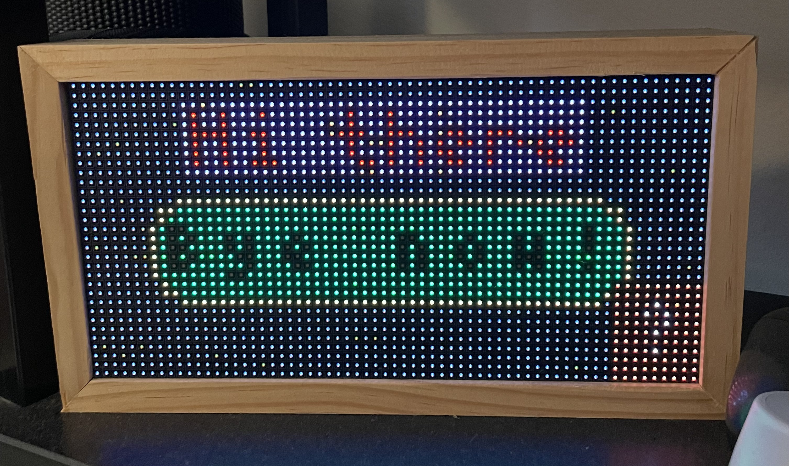

# clay-rpi-matrix

This repository contains a simple renderer for the [`clay`](https://github.com/nicbarker/clay) UI
layout library that targets Raspberry Pi matrix LED panels.

The matrix panel itself is driven by [`rpi-rgb-led-matrix`](https://github.com/hzeller/rpi-rgb-led-matrix).

Additional dependencies (all included in submodules/):
- [utf8.h](https://github.com/sheredom/utf8.h) for codepoint splitting

## Usage

See [`examples/basic/main.c`](examples/basic/main.c) for a simple example of how to use the renderer.

If run on a 64x32 panel, the example program looks like:

## Features
### Implemented
- Text (monospaced)
- Rectangles
- Borders
- Images (with some manual work)

### Not implemented

If you'd like to help out, these are the features that are not yet implemented:

- Scrolling/scissor regions
- Better image support
